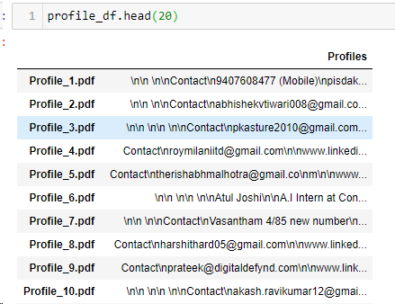
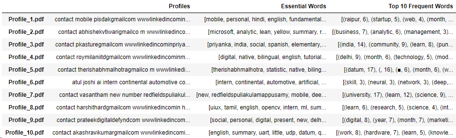
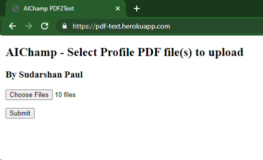
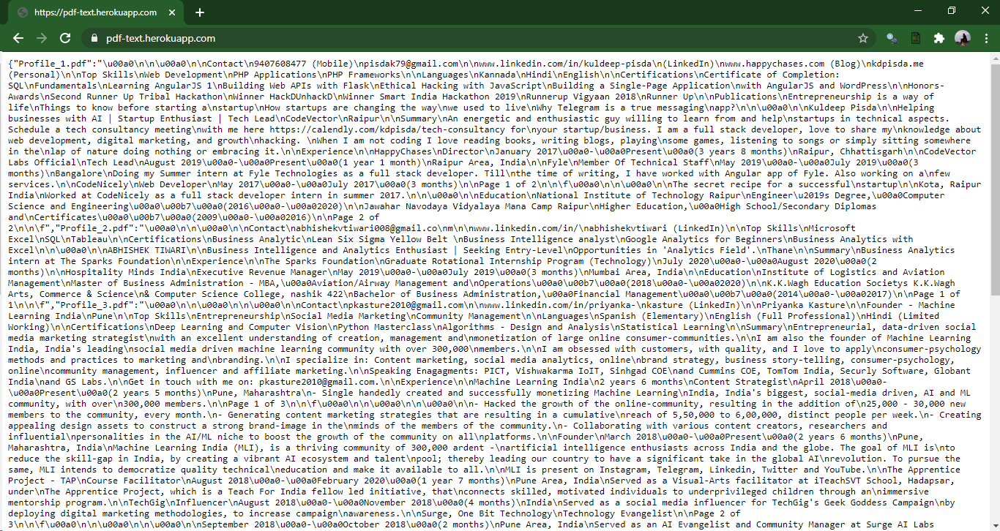
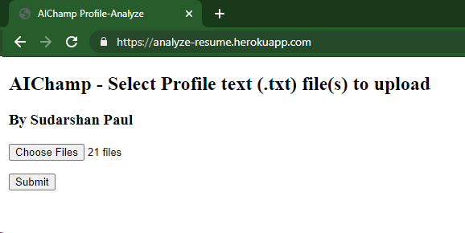
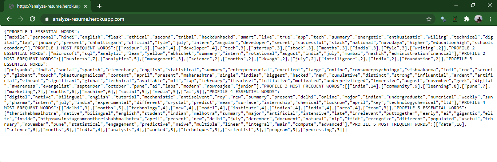

# AIChamp_Tasks
### Task 1 - Please refer to folder Profile Data.
### Task 2 and 3 codes have been documented in the file named AIChamp-Documented Code-Sudarshan Paul.ipynb 
### Task 4(a) API to convert PDF to text files [pdf-text-API](https://pdf-text.herokuapp.com/), code files can be found at "pdf-text-api" folder.
### Task 4(b) API to determine Most Essential and Frequent Words [analyze-resume-API](https://analyze-resume.herokuapp.com/), code files can be found at "analyze-resume-api" folder.
### Note : Folder "output-files" contains the (a.) Output CSVs and (b.) PDF to .txt converted Profile files. 
# Tasks
1. Download 50 public profile PDFs of your connections (randomly) from LinkedIn.
2. Extract text from the above PDFs and store them in a CSV.

3. For every profile data (text), find out the most frequent words and essential words used. It
shouldn’t contain stop words (like is, the, an, etc.).

# Cleaned and Pre-Processed Text Profile Data

                                   

4. Create two web APIs using flask/Django or another framework of your choice.
a. The first web API should take a PDF file as input and return the text in it in JSON
format.

#### Note : The WEB APIs are deployed on Heroku Platform.

## First WEB API - (pdf-text) [Converts uploaded PDFs to plain text format (.txt)]

[Click Here pdf-text-API](https://pdf-text.herokuapp.com/)

                                          

b. The second web API should take text data as input and return the most frequent
words and important words (as mentioned in 3) in JSON format.

[Click Here analyze-resume-API](https://analyze-resume.herokuapp.com/)

##  Second WEB API - (analyze-resume) [Determines the Most Essential words and Most Frequent words]

                              

### Essential Words and Frequent Words 

# Conclusion
Thus two working Web APIs were developed, the first one being [pdf-text-API](https://pdf-text.herokuapp.com/) which converts PDF profiles to plain text and stores them locally and also returns a .json response to the client (user). The second API [analyze-resume-API](https://analyze-resume.herokuapp.com/) which takes in the profiles in plain text file (.txt) and determines the Most Essential and Most frequently occuring words in the profile text corpus, finally returning them as .json to the user.
